<h1>Hi! I'm Alexandra Araujo💻🙋🏻</h1>

<h3>💜About me</h3>
  
 
  I'm a Full Stack developer  
  Focused on the continuous learning of new skills, with capacity in the creation of applications using web technologies, emphasizing the solution of problems in the environment and in teams.

 
The technologies I know are:

<ul align="left" > 
    <li>
💠 React and React-Redux
  </li> 
   <li>
🦾 JavaScript
  </li>
   <li>
🗂️ TypeScript
   </li>
   <li>
🟩 Node.js and Express
    </li>
 <li> 
🩻 HTML
  </li>
   <li>
💅 CSS
     </li>  
   <li>
🍃 MongoDB
     </li>
   <li>
🐘  PostgreSQL and Sequelize
     </li>
 </ul>
 

     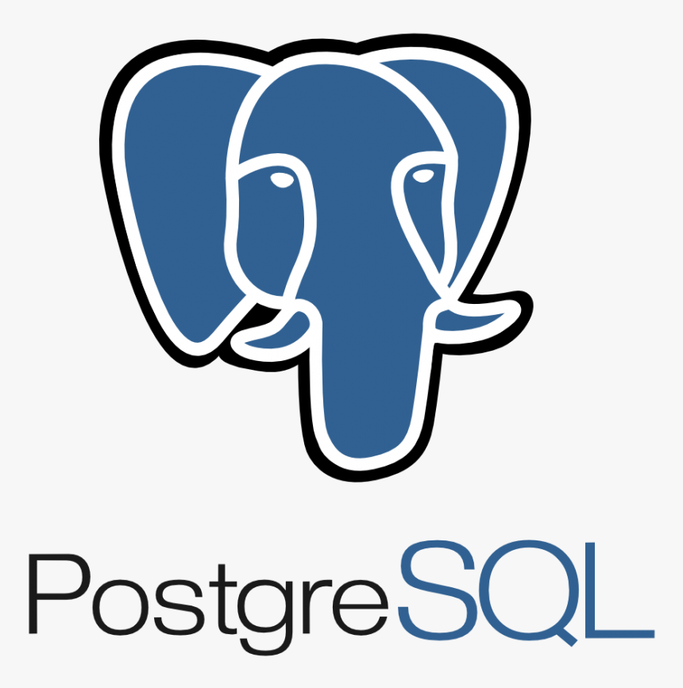 
  

## My projects

### 🐶 Dogs WebPage

A simple page aplication (SPA) showing the principal breeds around the world. The Dog's data is obtein from api.thedogapi.
  
  

  <a href="https://github.com/AleSangronis/PI-DOGS" target="_blank">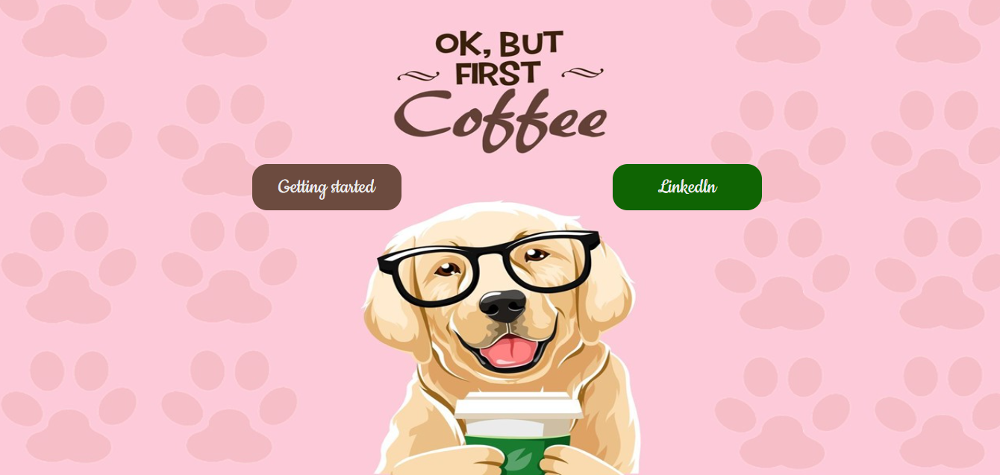</a>
   <a href="https://github.com/AleSangronis/PI-DOGS" target="_blank">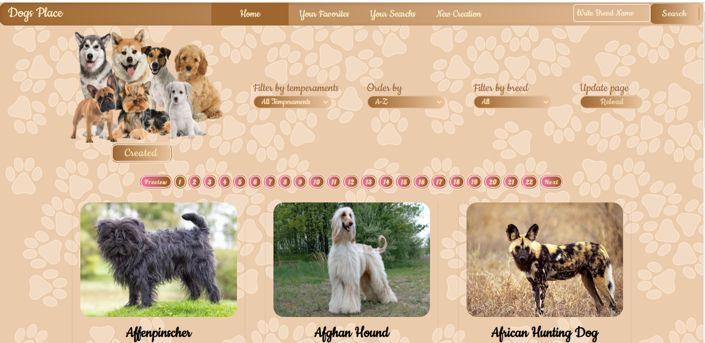</a>
     <a href="https://github.com/AleSangronis/PI-DOGS" target="_blank">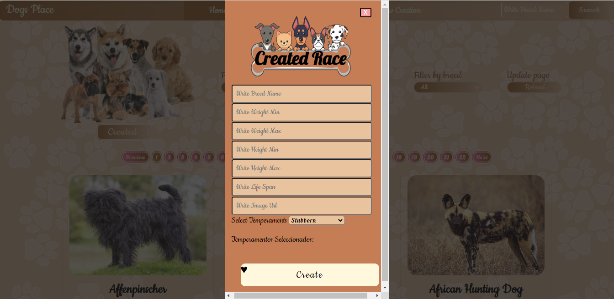</a>
       <a href="https://github.com/AleSangronis/PI-DOGS" target="_blank">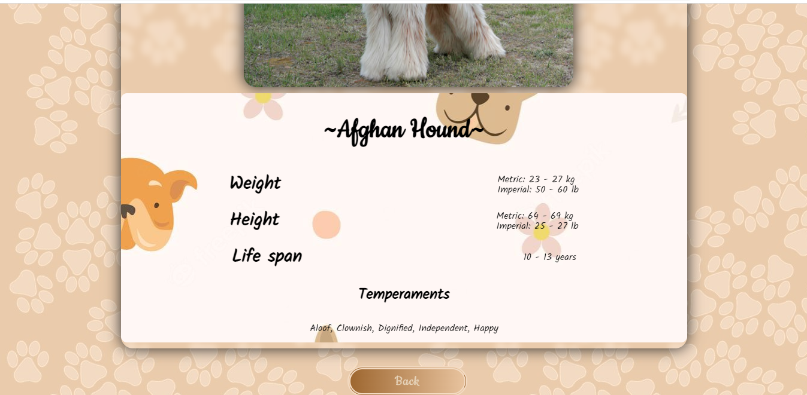</a>
        <a href="https://github.com/AleSangronis/PI-DOGS" target="_blank">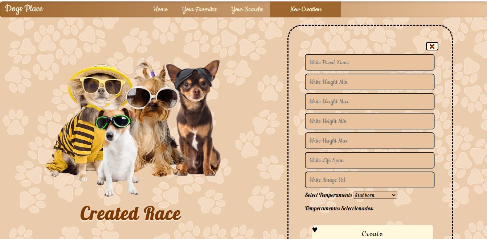</a>
       
### 📊 CoinTracker WebPage 

Website for cryptocurrency lovers

  <a href="https://pf-03-cointracker.vercel.app/" target="_blank">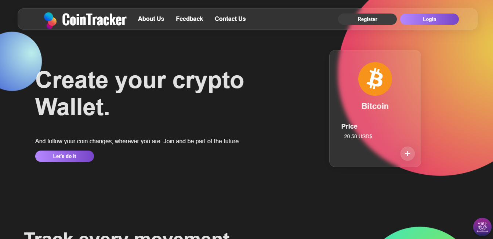</a>
  <a href="https://pf-03-cointracker.vercel.app/" target="_blank">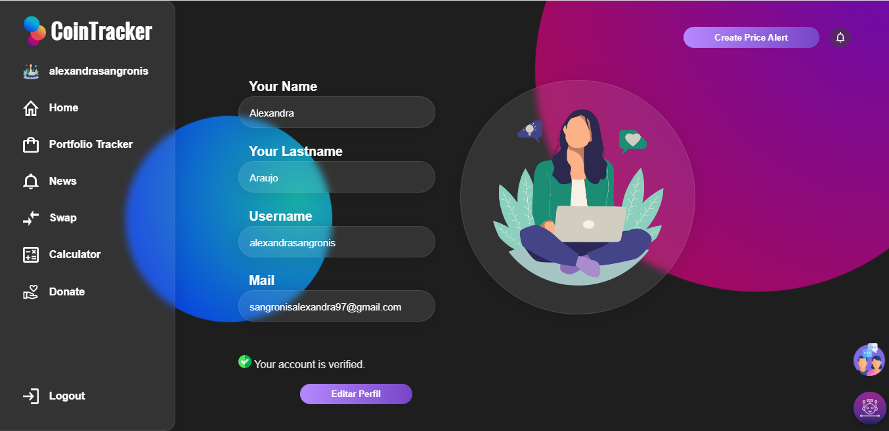</a>
   <a href="https://pf-03-cointracker.vercel.app/" target="_blank">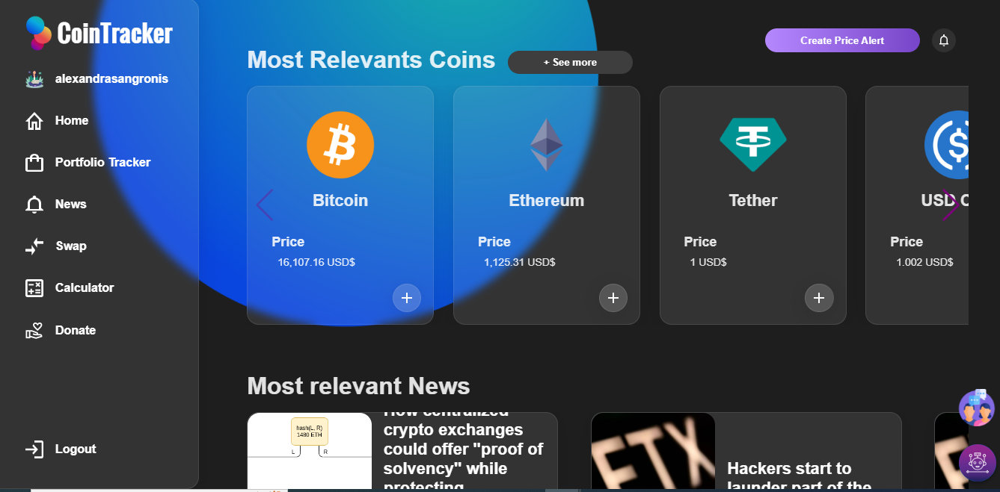</a>
     <a href="https://pf-03-cointracker.vercel.app/" target="_blank">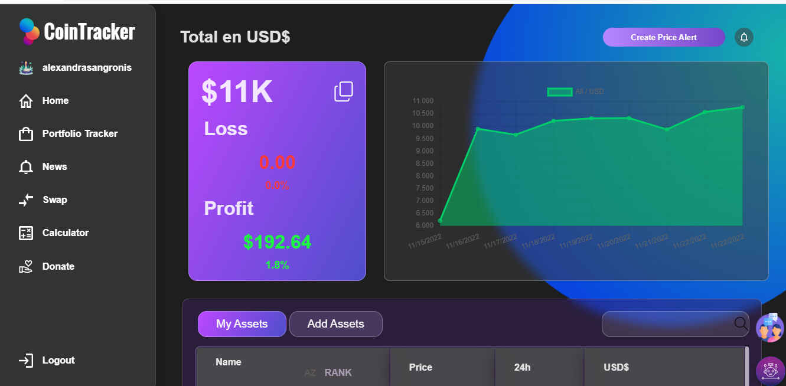</a>
        <a href="https://pf-03-cointracker.vercel.app/" target="_blank">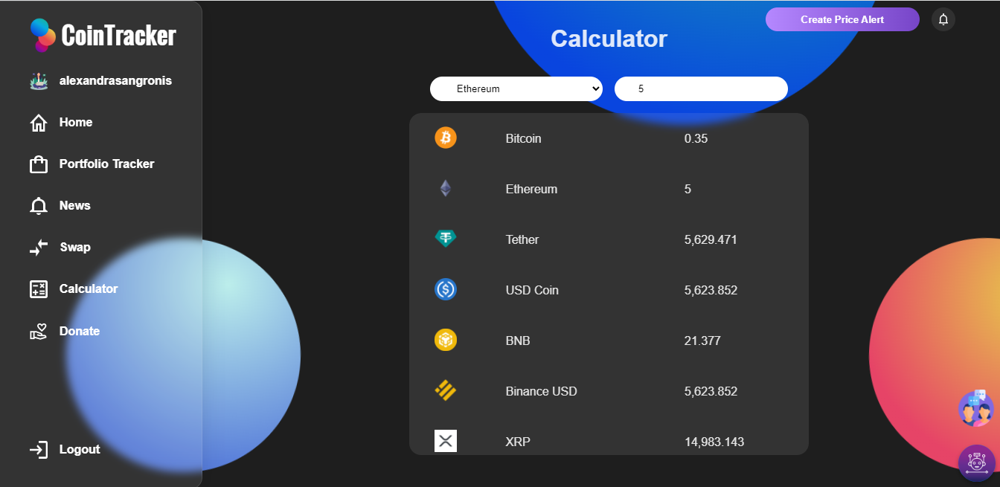</a>
    
    
## If you want to contact with my
<a target="_blank">👉 Email✉ sangronisalexandra97@gmail.com</a>
 
<a href="https://www.linkedin.com/in/alexandra-carolina-araujo-sangronis-4568a8154/" target="_blank">👉 💼 LinkedIn</a>
    
  
<!--
**AleSangronis/AleSangronis** is a ✨ _special_ ✨ repository because its `README.md` (this file) appears on your GitHub profile.

Here are some ideas to get you started:

- 🔭 I’m currently working on ...
- 🌱 I’m currently learning ...
- 👯 I’m looking to collaborate on ...
- 🤔 I’m looking for help with ...
- 💬 Ask me about ...
- 📫 How to reach me: ...
- 😄 Pronouns: ...
- ⚡ Fun fact: ...
-->
